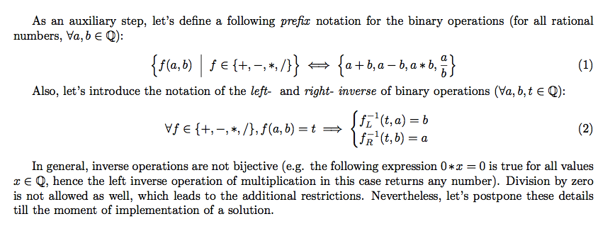
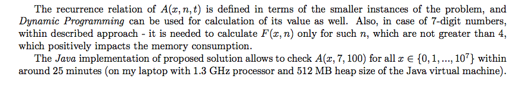

# ibm-ponder-this-june-2017
This repository contains my solution of the IBM Ponder This challenge in June 2017 (organized by IBM Research).

## Original problem statement
This month's challenge involves a game that can be played with seven-digit numbers (leading zeroes are allowed), such as the serial number of a bus ticket, a license plate number in Israel, phone numbers, etc. 

To play the game, take the seven-digit number and place the four basic operations `(+, -, *, and /)` and parentheses around and between the digits, using each digit exactly once (the parentheses and operations can be used more than once). Without changing the order or concatenating two or more digits into a larger number, use the basic operations and parentheses so that the answer of the mathematical equation is exactly 100. 

Some seven-digit numbers are solvable, like 3141592 which can be solved as `(3*1+4)*(1*5+9)+2` or a single digit change of it 3146592, which can also be solved as `3*((-1)+(-4)/6+5*(9-2))`, while other seven-digit numbers simply cannot be solved, such as 0314157. 

There are 63 ways to change a single digit in a seven-digit number. 
Here's the challenge: Find a seven-digit number that is not solvable, but is made solvable by 62 of the 63 single-digit changes. 

**Bonus '*' if the number is prime.**

*Update (5/6):* Division by zero is not allowed, but you can use non integers and unary minus (like the example above); and you get a '*' for every prime solution.

The URL of the web page with the problem description: http://www.research.ibm.com/haifa/ponderthis/challenges/June2017.html

## Mathematical description of the solution

The most important step of the solution is an efficient way to determine, whether a k-digit number `x` can be transformed into the arithmetic expression, which evaluates into the target number `n` (with respect to the restrictions of the problem).

Below is a description of my solution, based on the Dynamic Programming approach:



The described Dynamic Programming solution can be optimized in a following way:




The link to the PDF file with description of the solution: [yurii_lahodiuk_june_2017_solution.pdf](yurii_lahodiuk_june_2017_solution.pdf)

## Implementation of the described solution

The Java implementation of the described solution: [ArithmeticExpressionsSolver.java](ArithmeticExpressionsSolver.java)

## Answer

There are only two 7-digit numbers, which satisfy the conditions of the problem: **0397799** and **0765533**

```txt
0397799 (prime number)
All possible 62 single digit changes:
1397799	(((1)+(-3))*((((-9)*(7))*(-7))-(-9)))/(-9) = 100
2397799	((-2)*((3)-((((-9)+(-7))+(-7))/(9))))*(-9) = 100
3397799	((((-3)+((-3)/(9)))+(-7))+((-7)/(9)))*(-9) = 100
4397799	((((-4)*(-3))+(((-9)+(-7))*(7)))*(9))/(-9) = 100
5397799	(((-5)*((((-3)-(-9))-(-7))-(-7)))*(9))/(-9) = 100
6397799	(((-6)/(3))*((((-9)*(7))*(-7))-(-9)))/(-9) = 100
7397799	((((-7)+(-3))*((9)-((-7)/(7))))*(9))/(-9) = 100
8397799	(((((-8)+(-3))*(9))+((-7)/(7)))*(9))/(-9) = 100
9397799	((((-9)+(((-3)+(-9))*(7)))+(-7))*(9))/(-9) = 100
0197799	(((0)-(-1))-(((-9)+((-7)/(7)))*(9)))-(-9) = 100
0297799	(((0)+(-2))*((((-9)*(7))*(-7))-(-9)))/(-9) = 100
0497799	(((0)+(-4))*(((9)+(-7))-((-7)/(9))))*(-9) = 100
0597799	(((((0)-(-5))+(-9))*(-7))-((-7)*(9)))-(-9) = 100
0697799	((((0)-(-6))-(((-9)+(-7))*(7)))+(-9))+(-9) = 100
0797799	(((0)-(-7))+(-9))*(((-7)*(7))+((-9)/(9))) = 100
0897799	((((0)+(-8))-((-9)*((7)-(-7))))+(-9))+(-9) = 100
0997799	(((((0)+(-9))*(-9))-((-7)/(7)))-(-9))-(-9) = 100
0307799	((((0)+(-3))+(0))-((-7)*((7)-(-9))))+(-9) = 100
0317799	(((((0)+(-3))+(-1))*(-7))-((-7)*(9)))-(-9) = 100
0327799	(((0)+(-3))-((-2)*((-7)-((-7)*(9)))))+(-9) = 100
0337799	((((0)*(-3))+(-3))-((-7)*((7)-(-9))))+(-9) = 100
0347799	(((((0)*(-3))+(-4))*(-7))-((-7)*(9)))-(-9) = 100
0357799	(((((0)*(-3))-(-5))-(-7))-(-7))-((-9)*(9)) = 100
0367799	((((0)-(-3))+(-6))-((-7)*((7)-(-9))))+(-9) = 100
0377799	(((((0)-(-3))+(-7))*(-7))-((-7)*(9)))-(-9) = 100
0387799	((((0)+(-3))+(-8))+(((-7)/(7))/(9)))*(-9) = 100
0390799	(((((0)-(-3))-(-9))+(0))-(-7))-((-9)*(9)) = 100
0391799	((((0)+(-3))+(-9))-(((-1)+(-7))/(9)))*(-9) = 100
0392799	(((0)+(-3))-(((-9)-(-2))*((7)-(-9))))+(-9) = 100
0393799	(((((0)*(-3))-(-9))-(-3))-(-7))-((-9)*(9)) = 100
0394799	((((0)+(-3))*(-9))-((-4)*((7)-(-9))))-(-9) = 100
0395799	((((0)+(-3))*((-9)-(-5)))-(-7))-((-9)*(9)) = 100
0396799	(((((0)+(-3))-(-9))-(-6))-(-7))-((-9)*(9)) = 100
0398799	(((((0)-(-3))-((-9)*(8)))-(-7))-(-9))-(-9) = 100
0399799	(((0)-(-3))-((-9)*((9)-((-7)/(9)))))-(-9) = 100
0397099	(((((0)-(-3))-(-9))-(-7))+(0))-((-9)*(9)) = 100
0397199	((((0)+(-3))+(-9))-(((-7)+(-1))/(9)))*(-9) = 100
0397299	((((((0)+(-3))+(-9))*(-7))+(-2))-(-9))-(-9) = 100
0397399	(((((0)*(-3))-(-9))-(-7))-(-3))-((-9)*(9)) = 100
0397499	(((((0)*(-3))*(-9))+(-7))*((-4)+(-9)))-(-9) = 100
0397599	((((((0)+(-3))*(9))-(-7))*(5))*(9))/(-9) = 100
0397699	((((0)-(-3))+((-9)*(7)))*((6)-(-9)))/(-9) = 100
0397899	(((((0)-(-3))-(-9))-(-7))-((-8)*(9)))-(-9) = 100
0397999	((((((0)+(-3))+(-9))+(-7))/(9))+(-9))*(-9) = 100
0397709	((((((0)-(-3))+(-9))+(-7))*(-7))+(0))-(-9) = 100
0397719	((((((0)+(-3))+(-9))*(7))+(-7))*(-1))-(-9) = 100
0397729	((((((0)+(-3))*(9))*(7))-(-7))/(-2))-(-9) = 100
0397739	((((((0)*(-3))+(-9))+(-7))*(-7))+(-3))+(-9) = 100
0397749	(((((0)*(-3))+(-9))*(-7))-((-7)*(4)))-(-9) = 100
0397759	((((0)+(-3))*((-9)+(-7)))-(-7))-((-5)*(9)) = 100
0397769	(((((0)*(-3))*(-9))+(-7))*((-7)+(-6)))-(-9) = 100
0397779	((((((0)+(-3))*(9))-(-7))-(-7))*(-7))-(-9) = 100
0397789	((((0)-(-3))+((-9)*(7)))*((7)-(-8)))/(-9) = 100
0397790	((((((0)-(-3))+(-9))+(-7))*(-7))-(-9))+(0) = 100
0397791	((((0)-(-3))+(((-9)+(-7))*(7)))-(-9))*(-1) = 100
0397792	(((((0)+(-3))+((-9)*(7)))-(-7))-(-9))*(-2) = 100
0397793	(((((0)+(-3))*(-9))-(-7))-((-7)*(9)))-(-3) = 100
0397794	((((0)+(-3))*((9)-(-7)))*((7)+(-9)))-(-4) = 100
0397795	(((((0)+(-3))+(-9))-((-7)/(7)))+(-9))*(-5) = 100
0397796	((((0)-(-3))-(((-9)+(-7))*(7)))+(-9))+(-6) = 100
0397797	((((((0)+(-3))+(-9))/(-7))+(-7))+(-9))*(-7) = 100
0397798	((((0)*(-3))+(-9))+((-7)/((-7)-(-9))))*(-8) = 100

0765533 (prime number)
All possible 62 single digit changes:
1765533	((((((1)+(-7))*(6))*(5))*(5))/(3))/(-3) = 100
2765533	((((((-2)+(-7))+(-6))+(-5))*(5))*(3))/(-3) = 100
3765533	((((((-3)*(7))-(-6))+(-5))*(5))*(3))/(-3) = 100
4765533	(((((-4)*(7))*((6)-(-5)))-(-5))-(-3))/(-3) = 100
5765533	((((((-5)-(-7))+(-6))*(5))*(5))*(3))/(-3) = 100
6765533	((((((-6)*(7))-(-6))*(5))*(5))/(3))/(-3) = 100
7765533	(((((-7)/(7))+(-6))*(5))-((-5)/(3)))*(-3) = 100
8765533	(((((-8)+(-7))*(6))*((5)-(-5)))/(3))/(-3) = 100
9765533	((((((9)+(-7))+(-6))*(5))*(5))*(3))/(-3) = 100
0165533	(((((0)+(-1))+(-6))*(5))-((-5)/(3)))*(-3) = 100
0265533	((((((0)-(-2))+(-6))*(5))*(5))*(3))/(-3) = 100
0365533	(((0)+(-3))*(6))*((-5)+(((-5)/(3))/(3))) = 100
0465533	(((((0)+(-4))+(-6))*((5)-(-5)))*(3))/(-3) = 100
0565533	(((((0)+(-5))*(6))*(5))*((5)+(-3)))/(-3) = 100
0665533	((((((0)+(-6))*(6))*(5))*(5))/(3))/(-3) = 100
0865533	(((0)+(-8))-((((-6)*(5))+(-5))*(3)))-(-3) = 100
0965533	((((((0)+(-9))+(-6))+(-5))*(5))*(3))/(-3) = 100
0705533	(((((0)+(-7))+(0))*(5))-((-5)/(3)))*(-3) = 100
0715533	(((((0)+(-7))*(1))*(5))-((-5)/(3)))*(-3) = 100
0725533	((((0)+(-7))-(-2))*((5)-((-5)/(3))))*(-3) = 100
0735533	((((((0)+(-7))*(3))*(5))-(-5))*(3))/(-3) = 100
0745533	((((((0)*(-7))+(-4))*(5))*(5))*(3))/(-3) = 100
0755533	((((0)*(-7))+(-5))*((5)-((-5)/(3))))*(-3) = 100
0775533	(((((0)*(-7))+(-7))*(5))-((-5)/(3)))*(-3) = 100
0785533	((((((0)+(-7))+(-8))+(-5))*(5))*(3))/(-3) = 100
0795533	(((((0)+(-7))*(9))*(5))-((-5)*(3)))/(-3) = 100
0760533	(((0)-(-7))-((((-6)+(0))*(5))*(3)))-(-3) = 100
0761533	((((0)+(-7))*((6)+(-1)))-((-5)/(3)))*(-3) = 100
0762533	(((0)-(-7))-(((-6)*(2))*((5)-(-3))))+(-3) = 100
0763533	(((((0)+(-7))/(6))+(-3))*((5)-(-3)))*(-3) = 100
0764533	(((0)+(-7))*((-6)+(-4)))-((-5)*((3)-(-3))) = 100
0766533	((((0)-(-7))-(-6))-(((-6)*(5))*(3)))+(-3) = 100
0767533	((((((0)+(-7))+(-6))+(-7))*(5))*(3))/(-3) = 100
0768533	(((0)-(-7))-(((-6)*(8))*((5)+(-3))))+(-3) = 100
0769533	(((((0)+(-7))*((6)-(-9)))-(-5))*(3))/(-3) = 100
0765033	(((0)-(-7))-((((-6)*(5))+(0))*(3)))-(-3) = 100
0765133	(((0)-(-7))-((((-6)*(5))*(1))*(3)))-(-3) = 100
0765233	((((((0)+(-7))*(6))+(-5))*(-2))-(-3))-(-3) = 100
0765333	((((0)+(-7))*((6)+((-5)/(3))))+(-3))*(-3) = 100
0765433	((0)-(-7))-(((((-6)*(5))+(-4))-(-3))*(3)) = 100
0765633	(((0)-(-7))-(((-6)*(5))*((6)+(-3))))-(-3) = 100
0765733	(((((0)*(-7))+(-6))*(5))*((7)-(-3)))/(-3) = 100
0765833	((((0)+(-7))*(-6))-((-5)*((8)-(-3))))-(-3) = 100
0765933	(((0)-(-7))-((((-6)*(5))*(9))/(3)))-(-3) = 100
0765503	((0)-(-7))-((((-6)+((-5)*(5)))+(0))*(3)) = 100
0765513	(((((0)*(-7))+(-6))*(5))-(-5))*((-1)+(-3)) = 100
0765523	((((((0)*(-7))+(-6))*(5))*(5))*(2))/(-3) = 100
0765543	((((0)+(-7))*((-6)+(-5)))-((-5)*(4)))-(-3) = 100
0765553	((((((0)+(-7))+(-6))*(5))-(-5))*(5))/(-3) = 100
0765563	((((0)+(-7))*(-6))-((-5)*((5)-(-6))))-(-3) = 100
0765573	((((((0)+(-7))+(-6))+(-5))*(-5))-(-7))-(-3) = 100
0765583	(((0)-(-7))-(((-6)*(5))*((-5)-(-8))))-(-3) = 100
0765593	((((0)*(-7))+(-6))*((5)-((-5)*(9))))/(-3) = 100
0765530	(((0)-(-7))-(((-6)+((-5)*(5)))*(3)))+(0) = 100
0765531	(((0)+(-7))+(((-6)+((-5)*(5)))*(3)))*(-1) = 100
0765532	((((((0)*(-7))+(-6))*(5))*(5))/(3))*(-2) = 100
0765534	(((((0)-(-7))+((-6)*(5)))+(-5))-(-3))*(-4) = 100
0765535	((((((0)+(-7))+(-6))*(5))-(-5))/(3))*(-5) = 100
0765536	(((((0)+(-7))*(6))+(-5))*((-5)-(-3)))-(-6) = 100
0765537	(((((0)*(-7))+(-6))+((-5)*(5)))*(-3))-(-7) = 100
0765538	(((0)+(-7))+(((-6)+(-5))/((5)+(-3))))*(-8) = 100
0765539	((((0)+(-7))+(-6))*(((-5)+(-5))-(-3)))-(-9) = 100
```

## Screenshot from the IBM Ponder This web site for the June 2017 problem
 
This is mostly for myself :-)
 


I have provided the solution at the 12th of June:


